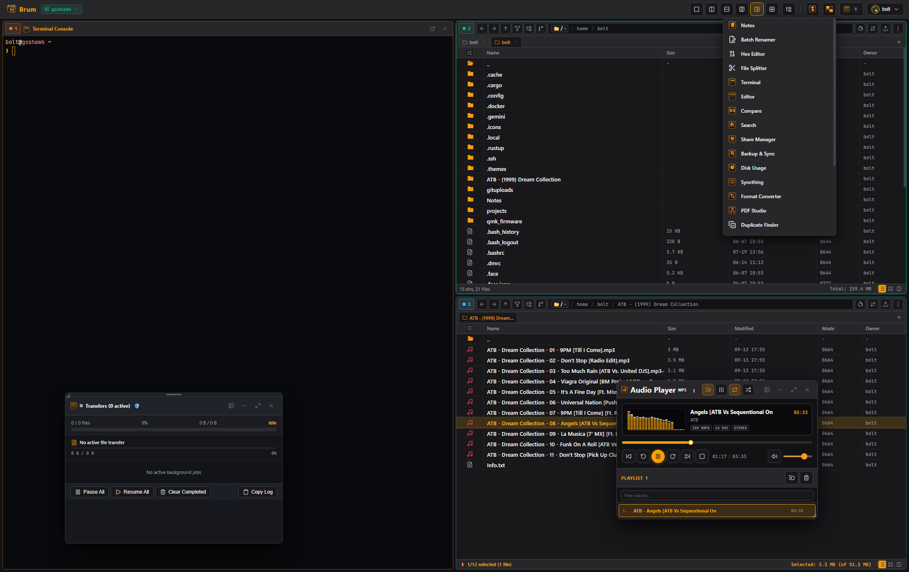

#  Brum

<div align="center">
  
  <p><em>Multi-Pane Web Environment (File Commander/Manager) — By Woofson</em></p>
  <p>
    <a href="https://github.com/Woofson/brum/releases/latest"></a>
    <a href="https://crates.io/crates/brum"></a>
    
    
    <a href="https://aur.archlinux.org/packages/brum"></a>
    <a href="https://ghcr.io/woofson/brum"></a>
    <a href="https://ko-fi.com/J7P327BXTR"></a>
  </p>
</div>

---

## Why Brum?

* **Instant 0ms Orthodox Multi-Pane Manager**: 1-to-4 dynamic panels (`Alt+1`–`4`), orthodox keyboard shortcuts (<kbd>F1</kbd>–<kbd>F10</kbd>), fast branch view, frame-0 optimistic pre-rendering, and directory fast caching.
* **Dual-Mode Floating & Dockable Core Functions**: 18+ integrated native power tools that freely toggle between floating desktop windows and in-pane docking with zero iframe overhead (3D CAD Studio, File Splitter & Combiner, PDF Studio, Sharing Center, Disk Usage Analyzer, Notes, Audio Player, Media Player, Terminal, Duplicate Finder, Batch Renamer, Hex Editor, Tag Editor, Log Viewer, Format Converter, and Delta Backup).
* **Synchronized Scrolling & Relative Navigation**: Mirrored viewport scrolling and relative subfolder navigation across active panels with loop prevention.
* **Universal Remote & Client VFS**: Direct zero-leakage client for SFTP/SSH, SMB/Windows Shares, NFS, S3 Cloud Storage, WebDAV, Proton Drive, Hetzner Storage Box, and browser-native Client Local Folder mounts (`client://`).
* **OpenID Connect (OIDC) & SSO Authentication**: Enterprise identity provider integration (Authentik, Keycloak, generic OIDC) with PKCE flow and token lifecycle management.
* **Zero-Knowledge Encrypted Vaults**: Password-protected `.cdvault` containers with Argon2id + AES-256-GCM RAM-only virtual streaming (no plaintext ever touches disk).
* **Dual Mode**: Run as a standalone native desktop app (Windows & Linux with tiling WM support) or as a headless web server.

---

## Quick Start

### Docker
```bash
docker run -d \
  --name brum \
  -p 3140:3140 \
  -v ./data:/data \
  -v /home:/mnt/home:rw \
  --restart unless-stopped \
  ghcr.io/woofson/brum:latest
```

### Arch Linux / CachyOS (AUR)
```bash
yay -S brum        # or: paru -S brum
```

### Cargo / Local Build
```bash
cargo run --release        # Open http://localhost:3140 in your browser
```

> **Default Login**: Username `admin`, Password `brum` *(or log in directly with any Linux host system account via PAM)*.

---

## Built-in Native Core Functions & Chewtoys Suite

| Core Function | Description | Replaced Utility |
| :--- | :--- | :--- |
| **3D CAD Studio** | Interactive 3D model & mesh viewer (STL, OBJ, DXF, PLY, STEP wireframe, slicing plane) | Blender / MeshLab / FreeCAD |
| **File Splitter & Combiner** | Chunk-based binary file splitting, MD5/SHA-256 integrity checks, and recombining | HJSplit / GSplit / 7-Zip |
| **PDF Studio** | Pure-Rust visual PDF page reordering, splitting, 90° rotation, page extraction & merger | PDFsam / Acrobat |
| **Sharing Center** | Public file & folder link sharing, passcodes, expiration rules, client upload dropzones | Nextcloud Share / Dropbox |
| **Disk Usage Analyzer** | Interactive disk usage analyzer, directory distribution bar charts & top files inspector | WinDirStat / Baobab / ncdu |
| **Notes** | SQLite-backed Markdown notebook, checklists, version snapshots, and encrypted notes | Obsidian / Joplin |
| **Audio Player & Media** | Audio player, mini-pills, windowshade mode, 10-band EQ, 60 FPS visualizer, .m3u playlists | Winamp / XMPlay |
| **Bite! Terminal** | Slide-Up WebSocket PTY terminal with bundled JetBrainsMono Nerd Fonts in active directory | PuTTY / Web SSH |
| **Duplicate Finder** | Multi-stage hash scanner (Blake3, SHA-256, MD5) with smart cleanup and filters | Czkawka / DupeGuru |
| **Batch Renamer** | Multi-pattern regex substitutions, auto-numbering, prefix/suffix, case transformations | Advanced Renamer |
| **Hex Editor** | Hexadecimal & ASCII binary byte inspector with search, jump to offset, and in-place editing | HxD / Hex Fiend |
| **Tag Editor & EXIF** | Audio ID3v1/ID3v2 metadata & album art editor, sequential auto-numberer & EXIF inspector | Mp3tag / ExifTool |
| **Log Viewer** | Real-time log tailing, regex & inverted filters, log level parsing, and autoscroll | lnav / tail -f |
| **Format Converter** | Browser-native image, audio, video, and document format transcoding | HandBrake / CloudConvert |
| **Sync & Replication** | Block-level binary delta replication (4 profiles), scheduler, and webhooks | Bvckup 2 / SyncToy |
| **Encrypted Vaults** | Zero-leakage AES-256-GCM in-memory encrypted virtual filesystem containers | Cryptomator / VeraCrypt |
| **Diff & Comparison** | Side-by-side text/code diffs and cryptographic directory comparison matrix | Beyond Compare / WinMerge |
| **Tetrion (Chewtoy)** | 60 FPS arcade canvas game, SRS rotation, DAS/ARR tuning & sync leaderboard | Desktop Distractions |

---

## Documentation & User Manuals

All operational runbooks, platform guides, and security manuals are available on the [**Official GitHub Wiki**](https://github.com/Woofson/brum/wiki) and organized in [**`manuals/`**](manuals/README.md):

* [**Power Tools & Chewtoys Manual**](manuals/chewtoys.md) — 3D CAD Studio, Splitter & Combiner, PDF Studio, Sharing Center, Disk Usage, Notes, Audio Player, Terminal, Vaults.
* [**Keyboard Shortcuts & Navigation**](manuals/shortcuts.md) — Orthodox <kbd>F1</kbd>–<kbd>F10</kbd> keys, audio player keys, touch gestures.
* [**Configuration Guide (`config.toml`)**](manuals/configuration.md) — Master config options, storage roots, sandboxing.
* [**Remote Protocols & VFS Guide**](manuals/protocols.md) — SFTP, SMB, NFS, WebDAV, S3, Proton Drive, Hetzner.
* [**Transparent Encrypted Vaults Guide**](manuals/vaults.md) — Argon2id + AES-256-GCM in-memory containers.
* [**Advanced Sharing & Client Portals**](manuals/sharing.md) — Public links, granular ACLs, dynamic watermarking, upload dropzones.
* [**Windows Desktop & Packaging**](manuals/windows.md) — Winget, Scoop, NSIS Setup, MSI, and Portable ZIP.
* [**Docker Deployment Guide**](manuals/docker.md) — Compose, Portainer, and volume persistence.
* [**Proxmox VE & LXC Containers**](manuals/lxc-proxmox.md) — 1-click Debian LXC container setup.
* [**Reverse Proxy & Mesh VPN Guide**](manuals/reverse-proxy.md) — Tailscale, NetBird, Caddy 2, Nginx, Traefik, Cloudflare.
* [**GitHub Milestones & Roadmap**](https://github.com/Woofson/brum/milestones) — Active milestones, roadmap vision, and release targets.
* [**GitHub Issues & Sprint Backlog**](https://github.com/Woofson/brum/issues) — Feature backlog, bug triage, and active sprint items.
* [**Changelog**](CHANGELOG.md) — Release notes and version history.

---

## Support & Contributions

If you find **Brum** useful and would like to support ongoing development, consider buying a coffee:

[](https://ko-fi.com/J7P327BXTR)

---

## License

MIT License © [Bolt J Woofson](https://www.arf.ac) @ Woofsons Lab

