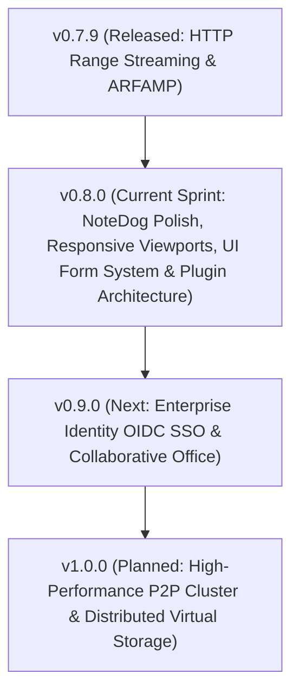

#  CommanderDog Product Roadmap & Active Backlog

> **Creator & Lab**: Bolt J Woofson @ Woofsons Lab ([www.arf.ac](https://www.arf.ac))  
> **Slogan**: *Multi-Tab File Commander for Web & Native Desktop — By Woofson*  
> **Current Version**: `v0.7.9 (Desktop & Web)`  
> **Publishing Prefix Rule**: All crates, binaries, and packages use the `arf-` or `arf_` prefix (e.g. `arf-cmdr`, `arf-remote`).  
> **Release History**: For detailed release notes and changelogs of past versions (`v0.1.0` — `v0.7.7`), see [**`CHANGELOG.md`**](CHANGELOG.md).

---

## 1. 🌟 The Ultimate Replacement Vision: One Commander ("ChewToys")

> *"Replace a scattered suite of 10+ disconnected utilities with a single, ultra-fast, unified Commander and a suite of built-in power-tools ('ChewToys')."*

```
┌────────────────────────────────────────────────────────────────────────────────────────────┐
│ The CommanderDog "ChewToy" Replacement Matrix                                              │
├────────────────────────┬─────────────────────────────┬─────────────────────────────────────┤
│ Legacy / External App  │ CommanderDog Native ChewToy │ Replaced Capabilities               │
├────────────────────────┼─────────────────────────────┼─────────────────────────────────────┤
│ FileZilla & Mountain D │ Native Multi-Protocol VFS   │ SFTP/SSH, SMB/CIFS, NFS, WebDAV,    │
│                        │                             │ Hetzner Storage Box, Proton Drive,  │
│                        │                             │ Google Drive & S3 Object Storage    │
├────────────────────────┼─────────────────────────────┼─────────────────────────────────────┤
│ rclone & rsync         │ DeltaCopy / RoboCopy        │ Differential delta streaming,       │
│                        │ Engine & Background Tasks   │ bandwidth throttling & auto-retry   │
├────────────────────────┼─────────────────────────────┼─────────────────────────────────────┤
│ Bvckup 2 & SyncToy     │ Backup Studio (SyncToy)     │ 4 replication profiles, in-place    │
│                        │                             │ block deltas, snapshots & scheduler │
├────────────────────────┼─────────────────────────────┼─────────────────────────────────────┤
│ Syncthing              │ Live Syncthing Dashboard    │ Peer status, throughput charts,     │
│                        │ & Direct Local/LAN Sync     │ folder scan triggers, P2P sync      │
├────────────────────────┼─────────────────────────────┼─────────────────────────────────────┤
│ PuTTY & OpenSSH SCP    │ Slide-Up PTY Web Terminal   │ Embedded WebSocket pseudo-terminal  │
│                        │ (Bite!)                     │ (fish/zsh/bash/powershell) in path  │
├────────────────────────┼─────────────────────────────┼─────────────────────────────────────┤
│ Total / Multi / MC /   │ 1-to-4 Multi-Tab Dynamic    │ Orthodox keyboard shortcuts, dual-  │
│ XYplorer / Directory O │ Panes & Orthodox Suite      │ pane power diff, batch rename,      │
│                        │                             │ branch view, rich MIME icon suite   │
├────────────────────────┼─────────────────────────────┼─────────────────────────────────────┤
│ Cryptomator / VeraCrypt│ AES-256-GCM Vaults          │ Zero-leakage in-memory containers   │
│                        │ (.cdvault)                  │ (Argon2id + AES-GCM RAM-only VFS)   │
├────────────────────────┼─────────────────────────────┼─────────────────────────────────────┤
│ HandBrake / FFmpeg GUI │ ConvertX Transcoder         │ Browser-native image/audio/video/   │
│                        │                             │ document conversion engine          │
├────────────────────────┼─────────────────────────────┼─────────────────────────────────────┤
│ PDFsam / Acrobat Split │ PDFDog (PDF Power Studio)   │ Pure-Rust visual merge, split,      │
│                        │                             │ page reordering & rotation grid     │
├────────────────────────┼─────────────────────────────┼─────────────────────────────────────┤
│ FastStone / Feh Viewer │ High-DPI Image Viewer       │ Mouse wheel browse, focal zoom,     │
│                        │                             │ slideshow, format conversion        │
├────────────────────────┼─────────────────────────────┼─────────────────────────────────────┤
│ Obsidian / Joplin      │ NoteDog Notes Studio        │ Hierarchical Markdown notebook,     │
│                        │                             │ checklists, revision diff history   │
├────────────────────────┼─────────────────────────────┼─────────────────────────────────────┤
│ Classic Arcade Tetris  │ TetraDog (Arcade ChewToy)   │ Authentic classic Tetris clone,     │
│ & Desktop Distraction  │                             │ 60 FPS canvas engine, SRS/NES modes,│
│                        │                             │ DAS/ARR tuning, high scores & audio │
├────────────────────────┼─────────────────────────────┼─────────────────────────────────────┤
│ Winamp / Foobar2000 /  │ ARFAMP (Winamp 2.x Clone    │ 3-modular layout, windowshade mode, │
│ Audacious / XMPlay     │ & 10-Band EQ ChewToy)       │ 10-band EQ, 60fps spectrum, .m3u PL │
└────────────────────────┴─────────────────────────────┴─────────────────────────────────────┘
```

---

## 2. 🎨 Design Language & Viewport Standards

### Standardized Viewports
* **`Phone`**: Mobile touch screens. Chewtoys open as overlay apps with minimal subtle headers.
* **`Tablet`**: Foldables & tablets touch. Responsive multi-column layout with touch targets.
* **`PC`**: Desktop / Laptop mouse & keyboard. Chewtoys are fully resizable and dockable into panels.

### UI & Chewtoy Design System
* **Panels vs Tabs**: File browsing panes are strictly termed **"Panels"**; **"Tabs"** are strictly reserved for settings and editor tabs.
* **Uniform Header Layout**:
  * Main header: Left space is Branding + Hostname badge; middle-right is Tasks and Chewtoy Apps; most right is User Profile & Settings (<kbd>F10</kbd>).
  * Action buttons across all tools and viewers share a uniform **`28px` height**, look, and feel.
  * Window control buttons (Close, Minimize, Maximize, Dock/Float) are neat, subtle, and consistent across all tools.
  * Full title bars serve as non-fiddly drag handles (`cursor: grab;`).
* **Official Themes**:
  * **`Woofsons Amber Charcoal`** (Dark - Default)
  * **`Woofsons Amber Zink`** (Light)

---

## 3. 🚀 Active Sprint & Improvement Backlog (`v0.8.0`)



### 🎯 Current Sprint Backlog (`v0.8.0`):

#### 1. 🐕 NoteDog Chewtoy Polish & Docked Mode
- [ ] **Docked Mode Note Dropdown Selection Fix**:
  - Fix note dropdown selection in docked mode where changing notes lags or shows the previously selected note instead of the newly selected item.
- [ ] **Docked True Dual-Edit (Side-by-Side Split Mode)**:
  - Implement full side-by-side Markdown source editor + live preview split mode in docked panel views.
- [ ] **Mobile & Tablet Sliding Collapsible Sidebar**:
  - Add responsive sliding/drawer sidebar for note hierarchy on `Phone` and `Tablet` viewports to maximize writing canvas area.

#### 2. 📱 Responsive Viewports, Micro-Text Scaling & Mobile/Tablet Ergonomics
- [ ] **Tablet Dual-Panel Mode Toggle**:
  - Make dual-panel mode optional/toggleable on `Tablet` viewport (allow 1-panel wide mode for tight screens).
- [ ] **Adaptive Viewport Typography & Micro-Text Scaling**:
  - Optimize info-text and secondary badge font sizes to be proportionally compact and legible on mobile and tablet screens.
- [ ] **Top Header Responsive Branding**:
  - Display CommanderDog branding badge on `Tablet` viewport while keeping it hidden on `Phone` to maximize path bar and panel space.
- [ ] **Phone Pane Columns (Owner & Permissions)**:
  - Add optional owner/group and UNIX permission (`rwxr-xr-x`) visibility in mobile phone panel item rows and details drawer.
- [ ] **Mobile Bookmarks Manager Trigger Fix**:
  - Fix Bookmarks manager modal/drawer tap triggering on phone viewport.

#### 3. 🎨 Design System & Theme Engine Form Harmonization
- [ ] **Standardized Form Control Components (`Woofsons Amber Charcoal` & `Amber Zink`)**:
  - **Checkboxes & Radios**: Theme-aware custom styled checkboxes with active amber glow, smooth transitions, and distinct states across dark and light themes.
  - **Input Fields**: Standardized padding, borders, focus outline ring (`var(--accent)`), and placeholder contrast across all modal forms and settings.
  - **Dropdown Menus & Selects**: Harmonized custom select components with consistent height (`28px` / `32px`), chevron icons, hover states, and dropdown popup styling.
- [ ] **Header Control Alignment & Icon Refinements**:
  - Swap topbar order of **ChewToys Apps Menu** and **Task Manager Pill** for more ergonomic access.
  - Replace cloud upload icon with sleek modern tray / upward arrow indicator (e.g. `arrow-up-to-line` / `upload`).

#### 4. 🧩 ChewToy Plugin Architecture & Extensible Scripting Specification (`.arf` / `.woof`)
- [ ] **ChewToy Modular Plugin System**:
  - Architecture and specification for dynamic external plugins packaged as `.arf` or `.woof` bundles.
  - Standard manifest format (`plugin.toml` / `manifest.json`), asset packaging, and permission sandboxing.
  - Scripting engine integration (native Shell / Bash script bridge leveraging embedded pseudo-terminal, plus optional lightweight WASM / QuickJS runtime for cross-platform sandboxed execution).

---

### 📦 Completed Milestone Backlog History (`v0.7.2` – `v0.7.9`):
- [x] **Documentation Reorganization & `manuals/` Structure (`v0.7.2-rc1`)**:
  - Reorganized loose root documentation into dedicated [`manuals/`](manuals/README.md).
  - Merged todos directly into `ROADMAP.md` as the unified source of truth.
- [x] **EditorDog Polish & Compact Canvas**:
  - Compact Single-Header Layout: Removed redundant inner document pane sub-headers; tabs now connect directly to the editor canvas.
  - Interactive Status Bar Language Selector: Moved syntax mode selector to the bottom status bar (`RUST ▾`, `JS / TS ▾`, `MARKDOWN ▾`, etc.) with auto-detection and 1-click override.
  - Standardized Save, New, Find, and Save All buttons to uniform `28px` Chewtoy header styling.
  - Replaced dropdown view/layout menu with right-aligned direct action toggle buttons (`Single`, `Dual Side`, `Dual Stack`, `Preview`).
- [x] **Notes Chewtoy (NoteDog) Header & Layout (`v0.7.2-rc4`)**:
  - Standardized NoteDog header to Chewtoy `28px` uniform height, rounded corners (`var(--radius)`), and full drag handle.
  - Aligned view mode switcher (`Editor`, `Split`, `Preview`) to right-aligned icon-only buttons matching CommanderDog layout controls.
  - Standardized note workspace sub-header buttons (`Save`, `Template`, `Delete`) to match panel toolbar button standards (`26px x 26px`).
- [x] **Universal Chewtoys & Windows Header/Toolbar Standardization (`v0.7.2-rc5`, `v0.7.2-rc6`)**:
  - Standardized all built-in Chewtoys and floating window headers (`Calculator`, `Image Viewer`, `Terminal`, `Task Manager`, `Diff Engine`, `Git Manager`, `Disk Usage`, `Sync Studio`, `ConvertX`, `PDF Studio`, `Deep Search`) to uniform `28px` square icon buttons with `border-radius: var(--radius)` (`6px`).
  - Right-aligned icon-only layout switches and tool controls with active amber glow styling and flat, stealthy window control buttons (`panel-left-close`, `panel-left-open`, `minus`, `maximize-2`, `x`, `picture-in-picture`, `external-link`).
  - Docked tool pane headers now use icon-only float buttons and 26px stealthy controls.
  - Standardized all sub-headers and inner workspace toolbars (`26px x 26px`) across note workspace, git staging, diff filters, disk usage path bar, sync replication bar, and calculator units row.
- [x] **Terminal Console (Bite!) Lifecycle & Exit Handling (`v0.7.2-rc6`)**:
  - Handled `Ctrl+D` (EOF), shell `logout`, and `exit` commands to automatically close drawer / docked tool and cleanly reset the PTY terminal state.
- [x] **ChewToy Design System & Layout Language Locking (`v0.7.2-rc7`)**:
  - Locked ChewToy Design & Layout Language Specification permanently into `GEMINI.md` (Section 7) and `.agents/rules/` for all future agent interactions.
  - Enforced 42px header bar with full drag handle, 28px square buttons, right-aligned icon-only layout groups, flat & stealthy window controls, 26px sub-headers, dual-mode docking, and lifecycle teardown protocols.
- [x] **Top Header Hostname & Environment Badge (`v0.7.2-rc8`)**:
  - Added dynamic hostname badge next to the logo in the top application header with platform info (OS/arch/user) and click-to-copy utility.
  - Added UI & Backend configuration (`config.toml` `[ui] show_hostname_badge`, `[ui] hostname_badge`, `[server] server_name`) with in-browser custom environment overrides (e.g. `NAS-PROD`, `HOMELAB-01`).
- [x] **Task Manager Polish & Auto-Dismiss (`v0.7.2-rc8`)**:
  - Main header activity pill button retains full 32px height to balance the profile bar.
  - Resolved stuck UI pills for fast background jobs; idle state now cleanly resets activity badge to 0 and immediately hides floating speed badges and pills.
  - Added automatic completed tasks auto-pruning in backend and frontend.
- [x] **Delta Backup & Sync Studio Templates & Visual Exclusion Builder (`v0.7.2-rc9`)**:
  - **1-Click Profile Templates**: Added instant setup presets (`🪞 NAS Mirror`, `💻 Codebase Sync`, `📦 Snapshot Vault`, `📸 Media Backup`) across live diff studio and scheduled job creator.
  - **Visual Exclusion Builder**: Interactive preset chips (`node_modules`, `.git`, `target/`, `.cache/`, `tmp/`, `*.tmp`, `.DS_Store`, `Thumbs.db`, `*.log`, `dist/`, `*.bak`) with dynamic custom wildcard tag adder and badge counter.
  - **Backend Exclusion Filtering**: Integrated pattern matcher into source/destination analysis and replication execution engine.
  - **SQLite Job Exclusions Persistence**: Updated `backup_profiles` schema with automated migration to persist exclusion patterns per job.
- [x] **Compact Breadcrumbs & Sleek Panel Git Badges**:
  - Tightened breadcrumb spacing (`gap: 2px;`), streamlined separator chips, and compacted storage root dropdown buttons.
  - Minified panel git branch badge (9.5px, 17px height, 10px icons) for an uncluttered path navigation bar.
- [x] **Universal "New ▶" Context Menu & File Template Engine**:
  - Full-surface right-click access: "New ▶" submenu is accessible anywhere across all file rows, cards, compact items, and empty background space.
  - Built-in rich templates for Plain Text (`.txt`), Markdown (`.md`), HTML5 (`.html`), CSS (`.css`), JavaScript (`.js`), TypeScript (`.ts`), Python (`.py`), Rust (`.rs`), Bash (`.sh`), JSON (`.json`), and YAML (`.yaml`).
  - Dynamic variable expansion: `{{TITLE}}` (humanized title), `{{FILENAME}}`, `{{NAME}}`, `{{DATE}}` (`YYYY-MM-DD`), `{{TIME}}`, `{{USER}}`, `{{ISO_DATE}}`, `{{YEAR}}`, `{{MONTH}}`, `{{DAY}}`, `{{AUTHOR}}`.
  - Interactive "Create from Template" dialog with real-time live preview code editor and instant EditorDog opening.
  - Full "Templates" manager tab in Settings to create, edit, duplicate, test, or delete custom file templates, plus 1-click "Save Selected File as Template" action.

### ⚡ Performance, Resource Scaling & Usability Backlog:
- [x] **Flat / Branch View (`Ctrl+B`) Performance & Seamless Revert Navigation** (Shipped in `v0.7.3-rc6`):
  - **Resource Scaling & UI Freeze Prevention**: Bounded backend recursive traversal with `WalkDir` `filter_entry` hidden tree pruning, safety item threshold (`MAX_BRANCH_ENTRIES = 5,000`), and non-blocking `tokio::task::spawn_blocking` execution.
  - **Direct Revert / Exit Mechanism**: Added prominent sticky `.pane-branch-banner`, cancelable `AbortController` scan indicator, clickable ancestor breadcrumb navigation, and multi-trigger exit pathways (Ctrl+B, parent `..` double-click, directory opening, tree navigation).
- [x] **Streamlined Single-Item Rename Modal (`F2`)** (Shipped in `v0.7.3-rc8`):
  - **Dedicated Quick-Rename Dialog**: Pressing `F2` opens a focused, lightweight rename modal with the input field auto-focused.
  - **Smart Selection & Keyboard Ergonomics**: Automatically pre-selects the filename without its extension for instant typing; `Enter` confirms and executes the rename; `Esc` immediately cancels without modifying the file.
- [x] **Streamlined New Folder Creation Modal (`F7`)** (Shipped in `v0.7.3-rc9`):
  - **Dedicated Quick-Mkdir Dialog**: Pressing `F7` opens a focused, lightweight new folder modal with instant autofocus and input selection.
  - **Keyboard Ergonomics & Context Resolution**: `Enter` confirms and executes creation via `/api/fs/mkdir`; `Esc` cancels immediately; accurate resolution of active vs context right-clicked panes with toast notifications.
- [x] **New Graphical Icons Integration (`note.png`, `conf.png`, `chewtoy.png`)** (Shipped in `v0.7.3-rc7`):
  - **NoteDog Visual Identity**: Integrate dedicated asset `assets/note.png` across NoteDog headers, Launchpad menu, and spotlight entries.
  - **Settings & Config Identity**: Integrate dedicated asset `assets/conf.png` for Settings modal triggers, menu actions, and header buttons.
  - **ChewToys Suite Launcher**: Update the Tools/ChewToys suite button and header icons with dedicated asset `assets/chewtoy.png`.
- [x] **ChewToy Unified Shortened Nomenclature** (Shipped in `v0.7.3-rc7`):
  - Standardize and harmonize the 17 built-in power utilities across all dropdown menus, tooltips, settings, and Spotlight search (`Ctrl+K`):
    - `Spot!` (Spotlight Quick-Shifter `Ctrl+K`)
    - `Task Manager` (Background Transfers & Queue)
    - `Terminal` (Slide-Up PTY Web Terminal `'`)
    - `EditorDog` (Multi-Tab Code Editor `F4`)
    - `Calculator` (Floating Calculator & Converter)
    - `Tree` (Folder Hierarchy Tree `Ctrl+T`)
    - `Flat` (Flat / Branch View `Ctrl+B`)
    - `NoteDog` (Notes & Markdown Studio)
    - `Compare` (Side-by-Side Diff Engine `F9`)
    - `Search` (Deep File Search `Ctrl+F`)
    - `Share Manager` (Active Shares & Dropboxes)
    - `Backup` (Delta Backup & Sync Studio - SyncToy / Bvckup2)
    - `Stats` (Disk Usage & Treemap Analyzer)
    - `Syncthing` (Live Syncthing Dashboard)
    - `ConvertX` (Universal Transcoder & Converters)
    - `PDFDog` (PDF Power Studio - Merge & Split)
    - `TetraDog` (Classic Arcade Tetris & Leaderboard)
- [x] **NoteDog Encrypted Notes & Cross-TUI Compatibility** (Shipped in `v0.7.3-rc8`):
  - **Encrypted Notebooks & Sections**: Support unlocking, editing, and saving encrypted notes and notebook sections using ChaCha20-Poly1305 / Argon2id container standards (`.md.enc` format, `.encrypted` section markers).
  - **NoteDog TUI Cross-Compatibility**: Full interoperability and symmetric decrypt/encrypt parity between the CommanderDog NoteDog ChewToy and the NoteDog TUI terminal client.
- [x] **Disk Usage & Storage Treemap Analyzer Optimization (`Stats` ChewToy)** (Shipped in `v0.7.3-rc12`):
  - **Parallel Rayon Walker & Bounded Memory Allocation**: Implemented multi-threaded parallel directory traversal with `rayon` par_iter and bounded top-20 heap tracking for zero-allocation safety.
  - **Interactive Proportional Treemap & Multi-Color Distribution**: Added responsive proportional squarified/flex treemap tiles with category gradients, 1-click drill-down, and stacked multi-colored storage proportion bar.
  - **Interactive Navigation & Breadcrumbs**: Added full breadcrumb path navigation chips, parent directory (`Up ..`) jump button, real-time live filter, quick panel jump, and terminal launcher.
  - **ChewToy Standards Alignment**: Standardized 42px drag handle header, right-aligned 28px view switchers (`Split`, `Treemap`, `List`), maximize/restore toggle, and 26px sub-header toolbars.
- [x] **TetraDog (Authentic Classic Tetris ChewToy & Leaderboard)** (Shipped in `v0.7.7-rc1`):
  - **Frame-Accurate 60 FPS HTML5 Canvas Engine**: Zero-lag fixed-timestep game loop (`requestAnimationFrame`) engineered for ultra-responsive control and razor-sharp inputs during high-speed master gravity (Level 15+ up to 20G instant drop).
  - **Competitive Input Ergonomics (DAS & ARR Tuning)**: Sub-millisecond keyboard event handling with customizable Delayed Auto Shift (DAS, ~133ms default) and Auto Repeat Rate (ARR, ~16ms/0ms instant repeat), customizable keybindings (Arrow keys, WASD, Numpad, Space hard drop, Shift/C hold), and responsive touch D-pad for Phone/Tablet viewports.
  - **Authentic Mechanics & Guideline Parity**:
    - **Fair 7-Bag Randomizer**: True 7-bag piece distribution preventing prolonged piece droughts.
    - **Rotation & Wall Kicks**: Super Rotation System (SRS) with standard 5-point wall kicks, plus optional toggle for classic NES single-rotation.
    - **Guideline Features**: Ghost piece projection, Hold queue (1-swap per turn), Lock Delay (0.5s with maneuver reset limit), and full/mini T-Spin detection.
  - **Authentic Scoring System & Progressive Gravity**:
    - Original scoring curve: Single (100×L), Double (300×L), Triple (500×L), Tetris 4-line clears (800×L), Back-to-Back bonuses, Hard/Soft drop points, and T-Spin bonuses.
    - Progressive gravity scaling across Levels 1–20+ with progressive line clear level-up thresholds.
  - **High Score Leaderboards**:
    - **Local Scoreboard**: Persistent `localStorage` tracking personal Top 10 high scores, cleared lines, max level, and timestamps.
    - **Server-Wide High Scores**: SQLite backend integration (`/api/chewtoys/tetradog/scores`) sharing instance-wide synchronized multi-user leaderboards with player aliases and rankings.
  - **Zero-Dependency 8-Bit Web Audio Synthesizer**:
    - Retro synthesized audio effects (movement bleeps, hard drop slam, line clear fanfare, level-up arpeggio, game over chime) using the browser Web Audio API oscillator with 1-click sound mute.
  - **ChewToy Standards Compliance**:
    - Dual-mode architecture: Freely floating draggable/resizable window (`42px` drag handle header) or docked directly into Panel 1 / Panel 2.
    - Uniform `28px` stealth window action buttons (Pause, Restart, Leaderboard, Audio, Settings, Dock/Float, Close).
    - Retro theme palettes: `Woofsons Amber Charcoal` (default amber glow), `Game Boy Monochrome Green`, `NES 8-Bit Retro`, and `Arcade Cyberpunk`.
- [x] **ARFAMP (Authentic Winamp 2.x Clone & 10-Band EQ ChewToy)** (Shipped in `v0.7.8-rc2`):
  - **Modular 3-Window Architecture**: Classic Winamp 2.x snappable layout (Main Player, 10-Band Equalizer, Playlist Editor) with independent and global Windowshade modes (<kbd>Alt+W</kbd>).
  - **Fluorescent Green/Amber LED 7-Segment Timer**: Real-time LED digital timer with click-to-toggle between *Time Elapsed* and *Time Remaining* (`-MM:SS`).
  - **Amber Marquee Scrolling Track Ticker & HUD**: Marquee track title ticker with `KBPS` bitrate, `KHZ` sample rate, and active `STEREO`/`MONO` indicator lights.
  - **Real-Time 60 FPS Winamp Visualizer**: 18-band segmented green/amber/red LED spectrum analyzer with falling peak caps, CRT phosphor oscilloscope waveform, and ambient glow modes.
  - **10-Band Graphic Equalizer (EQ)**: Studio biquad peaking filters (`60Hz`, `170Hz`, `310Hz`, `600Hz`, `1kHz`, `3kHz`, `6kHz`, `12kHz`, `14kHz`, `16kHz`), Preamp fader (-6dB to +6dB), ON/AUTO switches, and 8 acoustic presets (*Flat, Bass Boost, Rock, Synthwave, Acoustic/Vocal, Jazz, Classical, Pop*).
  - **Playlist Editor & M3U Export**: Monospace green-on-black numbered track list, quick filter search, drag & drop track enqueueing, resize handle, and action buttons (`+FILE`, `+DIR`, `-FILE`, `-ALL`, `SHUF`, `LIST` .m3u export).
  - **Authentic Winamp Keyboard Shortcuts**: <kbd>Z</kbd> Prev, <kbd>X</kbd> Play, <kbd>C</kbd> Pause/Unpause, <kbd>V</kbd> Stop, <kbd>B</kbd> Next, <kbd>L</kbd> Open Files, <kbd>Alt+W</kbd> Shade, <kbd>Alt+G</kbd> EQ, <kbd>Alt+E</kbd> PL, <kbd>S</kbd> Shuffle, <kbd>R</kbd> Repeat, <kbd>←</kbd>/<kbd>→</kbd> Seek, <kbd>↑</kbd>/<kbd>↓</kbd> Volume, <kbd>Delete</kbd> Remove Track.
  - **Future Skinning Roadmap**: Planned support for 1:1 pixel-accurate classic Winamp 2 / XMMS skin archives (`.wsz`, `.zip`) with bitmap sprite sheet loaders (`MAIN.BMP`, `CBAR.BMP`, `TITLEBAR.BMP`, `EQMAIN.BMP`, `PLEdit.BMP`, `NUMBERS.BMP`, `TEXT.BMP`).

---

## 4. 🔮 Upcoming Strategic Milestones

### Milestone 1: Multi-Cloud VFS, Embedded WebDAV Server & High-Impact Extensions (`v0.8.0`)
- **Embedded WebDAV Server Mode**: Native WebDAV server daemon allowing external operating systems (Windows File Explorer, macOS Finder, Linux, mobile apps) to mount CommanderDog storage as local network drives.
- **Multi-Cloud VFS Adapters**: Native connectors for Google Drive, Proton Drive, Hetzner Storage Box, and direct S3/MinIO browser streaming.
- **HexDog & ArchiveDog ChewToys**: In-place multi-format archive explorer (`.zip`, `.tar.gz`, `.7z`, `.zstd`) and binary byte/hex inspector.
- **ARFAMP Classic Skin Loader (`.wsz`)**: Native unpacker and renderer for classic Winamp 2.x and XMMS skin archives.
- **ChewToy Modular Plugin Architecture (`.arf` / `.woof`)**: Dynamic external plugin packaging, manifest specification (`plugin.toml`), permission sandboxing, and Shell/Bash terminal bridge.
- **User Profile Photos & Cross-Platform Native Avatar Fetcher**:
  - **Local & Standalone Profile Avatars**: Support custom profile picture / avatar uploads and cropping in local and single-user modes, persisted in SQLite user preferences.
  - **Native OS Avatar Auto-Detection**:
    - **Linux**: Automatic discovery and extraction of system user profile photos from AccountsService (`/var/lib/AccountsService/icons/<username>`), user home dotfiles (`~/.face`, `~/.face.icon`), or system icon paths.
    - **Windows**: Automatic extraction from Windows Account Pictures directory (`%APPDATA%\Microsoft\Windows\AccountPictures` / `%PROGRAMDATA%\Microsoft\User Account Pictures`) or registry user tile properties.
  - **Online Fallback Resolvers**: Optional Gravatar / Libravatar email hash lookup and upstream OAuth/OIDC profile avatar fallback.

### Milestone 2: Enterprise Identity, OIDC / SSO & Collaborative Office (`v0.9.0`)
- **Enterprise Identity Providers**: OpenID Connect (OIDC), OAuth2, SAML 2.0, Keycloak, Authentik, Authelia, Google, GitHub, Okta, Azure AD.
- **Collaborative Document Editing**: In-browser real-time collaborative editing for markdown, code, and Office documents (`.docx`, `.xlsx`, `.pptx` via Collabora / OnlyOffice WOPI integration).

### Milestone 3: High-Performance P2P Cluster & Distributed Virtual Storage (`v1.0.0`)
- **Cluster Node Mesh**: Direct peer-to-peer authenticated node clustering with distributed metadata synchronization.
- **Distributed Virtual Storage**: Multi-host unified mountpoints and automated cross-node replication.

---

## 5. 📊 Release Version Matrix

| Version | Milestone Focus | Status | Changelog |
| :--- | :--- | :--- | :--- |
| **`v0.3.0`** | In-Pane Tool Docking, ConvertX, Dual-Pane Editor | **Released** | [View Notes](CHANGELOG.md#030---2026-08-15) |
| **`v0.3.5`** | Wayland Windowing, GDK Fix, AUR Automated Sync | **Released** | [View Notes](CHANGELOG.md#035---2026-08-18) |
| **`v0.3.6`** | XDG Fast-Path Config, External TOML Themes, Web Theme Creator | **Released** | [View Notes](CHANGELOG.md#036---2026-08-20) |
| **`v0.4.0`** | Multi-Part Splitter, Integrated Git Client, Auto-$HOME Startup | **Released** | [View Notes](CHANGELOG.md#040---2026-08-22) |
| **`v0.4.1`** | Storage Roots, Sandboxing, Per-User Root RBAC, Alpine GHCR | **Released** | [View Notes](CHANGELOG.md#041---2026-08-24) |
| **`v0.4.2`** | Multi-Tier SSH/SFTP Auth, Dynamic PAM Engine, $HOME Resolution | **Released** | [View Notes](CHANGELOG.md#042---2026-08-26) |
| **`v0.5.0`** | Zero-Leakage Credentials, Leftmost Pane Customizer, Modern Navbar | **Released** | [View Notes](CHANGELOG.md#050---2026-08-28) |
| **`v0.5.5`** | Transparent Encrypted Vaults (.cdvault), Cross-Mount Deletions | **Released** | [View Notes](CHANGELOG.md#055---2026-08-29) |
| **`v0.6.0`** | Windows Native Build & Release (MSI, ZIP, Winget, Scoop, WebView2) | **Released** | [View Notes](CHANGELOG.md#060---2026-08-30) |
| **`v0.6.5`** | PDF Split/Merger, Mouse-Wheel Image Navigation & Dynamic Statusbar | **Released** | [View Notes](CHANGELOG.md#065---2026-08-31) |
| **`v0.6.6`** | Windows Service, Autostart Management & Rich Icon Suite | **Released** | [View Notes](CHANGELOG.md#066---2026-08-31) |
| **`v0.6.7`** | Orthodox Context Menu, Properties Dialog, GFM & HTML Editor | **Released** | [View Notes](CHANGELOG.md#067---2026-09-01) |
| **`v0.6.8`** | Resizable Columns, Custom Chooser, Multi-Size Grid & Tree Sidebar | **Released** | [View Notes](CHANGELOG.md#068---2026-09-01) |
| **`v0.6.9`** | Bvckup 2 & SyncToy Delta Backup, Background Daemons & Automation | **Released** | [View Notes](CHANGELOG.md#069---2026-09-01) |
| **`v0.7.0`** | NoteDog Notes Studio, Tags & Colors, Custom Workspaces | **Released** | [View Notes](CHANGELOG.md#070---2026-09-01) |
| **`v0.7.1`** | Universal Floating Viewers, Live Tail Follow, Bundled Fonts & Themes | **Released** | [View Notes](CHANGELOG.md#071---2026-09-03) |
| **`v0.7.2`** | Documentation Reorganization & Chewtoy UI/UX Refinements | **Released** | [View Notes](CHANGELOG.md#072---2026-09-04) |
| **`v0.7.3`** | WebP Icon Suite, Visual Disk Treemap, NoteDog Encryption & Release Automation | **Released** | [View Notes](CHANGELOG.md#073---2026-09-04) |
| **`v0.7.7`** | TetraDog (Classic Arcade Tetris ChewToy & Synchronized Leaderboard) | **Released** | [View Notes](CHANGELOG.md#077---2026-09-07) |
| **`v0.7.8`** | ARFAMP (Authentic Winamp 2.x Clone & Equalizer ChewToy) | **Released** | [View Notes](CHANGELOG.md#078---2026-09-07) |
| **`v0.7.9`** | HTTP Range Audio Streaming Fix & ARFAMP Official Rebranding | **Released** | [View Notes](CHANGELOG.md#079---2026-09-07) |
| **`v0.8.0`** | Multi-Cloud VFS, Embedded WebDAV Server & High-Impact Extensions | *Planned* | — |
| **`v0.9.0`** | Enterprise OIDC / SSO, Collaborative Office (WOPI) & RBAC | *Planned* | — |
| **`v1.0.0`** | High-Performance P2P Cluster & Distributed Virtual Storage | *Planned* | — |
