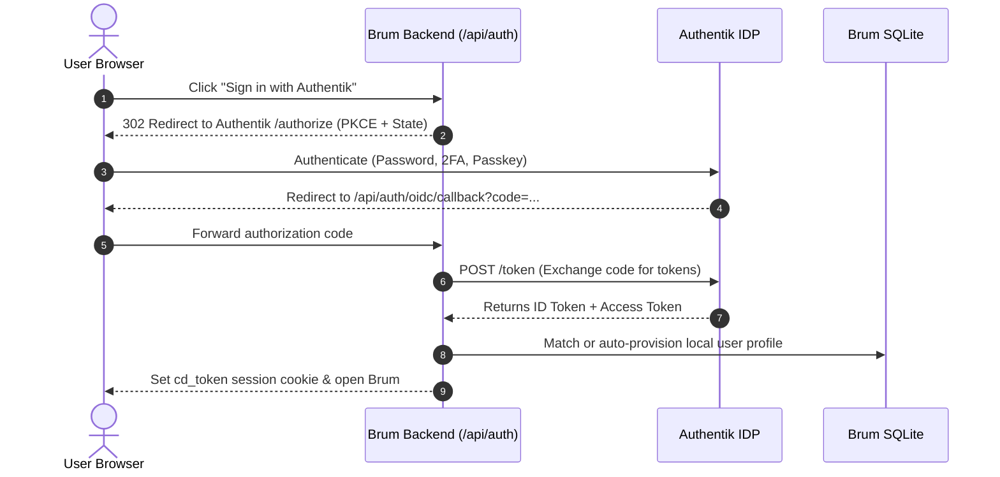

# OpenID Connect (OIDC) & Authentik SSO Setup Guide

This guide walks you through setting up **Single Sign-On (SSO)** in Brum using **[Authentik](https://goauthentik.io/)** (or any standard OpenID Connect provider such as Keycloak, Authelia, Okta, or Google Workspace).

---

## 1. Overview & Architecture

Brum uses standard **OAuth 2.0 / OpenID Connect (OIDC) Authorization Code Flow with PKCE (Proof Key for Code Exchange)**.



---

## 2. Setting Up Authentik (Step-by-Step)

### Step 1: Create an OAuth2/OpenID Provider in Authentik

1. Log in to your Authentik web dashboard as an administrator.
2. In the left navigation sidebar, expand **Applications** and click **Providers**.
3. Click **Create** in the top right.
4. Select **OAuth2/OpenID Provider** and click **Next**.
5. Fill in the Provider settings:
   - **Name**: `Brum Provider` (or `Brum SSO`)
   - **Authentication flow**: Choose your default authentication flow (e.g., `default-authentication-flow`).
   - **Authorization flow**: Choose your default authorization flow (e.g., `default-provider-authorization-implicit-consent`).
   - **Client type**: `Confidential`
   - **Client ID**: Leave the auto-generated string or enter a custom one (e.g. `brum-sso`).
   - **Client Secret**: Copy this secret — you will need it for `brum.toml`.
   - **Redirect URIs / Allowed Callback URLs**:
     ```text
     https://brum.example.com/api/auth/oidc/callback
     ```
     *(If testing locally on LAN/HTTP: `http://192.168.1.100:8080/api/auth/oidc/callback` or `http://localhost:8080/api/auth/oidc/callback`)*
   - **Signing Key**: Select your Authentik self-signed or Let's Encrypt certificate.
   - **Subject mode**: `Based on the User's username` (or `Based on the User's Email`).
   - **Selected property mappings**: Ensure the following scopes are highlighted/selected:
     - `authentik default OAuth2 Mapping: OpenID 'openid'`
     - `authentik default OAuth2 Mapping: OpenID 'email'`
     - `authentik default OAuth2 Mapping: OpenID 'profile'`
     - `authentik default OAuth2 Mapping: OpenID 'groups'`
6. Click **Finish**.

---

### Step 2: Create the Brum Application in Authentik

1. In Authentik sidebar, go to **Applications** > **Applications**.
2. Click **Create**.
3. Fill in the Application settings:
   - **Name**: `Brum`
   - **Slug**: `brum` *(Note: this defines your Issuer URL)*
   - **Provider**: Select the `Brum Provider` you created in Step 1.
   - **UI Settings** (Optional):
     - **Launch URL**: `https://brum.example.com/`
     - **Icon URL**: Upload Brum's icon (`assets/brum.png`).
4. Click **Create**.

---

### Step 3: Note Your Authentik Issuer URL

Authentik structures application issuer URLs as:
```text
https://<authentik-domain>/application/o/<application-slug>/
```

For example, if your Authentik instance is `https://auth.company.com` and your application slug is `brum`, your Issuer URL is:
```text
https://auth.company.com/application/o/brum/
```
*(You can verify this by opening `https://auth.company.com/application/o/brum/.well-known/openid-configuration` in your browser).*

---

### Step 4: Configure Admin Groups & Permissions in Authentik

To give certain users **Superadmin** access in Brum automatically:
1. In Authentik, go to **Directory** > **Groups**.
2. Click **Create** and name the group `brum-admins` (or use existing `authentik Admins`).
3. Add your administrator users to this group.
4. When a user in `brum-admins` logs in through SSO, Brum automatically elevates their role to `admin`.

---

## 3. Configuring Brum

You can configure Brum using `brum.toml` (or via Docker Environment Variables).

### Option A: Configuration via `brum.toml`

Add or update the `[auth.oidc]` section in your `brum.toml`:

```toml
[auth]
mode = "mixed" # Allows both local admin login and SSO

[auth.oidc]
enabled = true
provider_name = "Authentik" # Text shown on the login button
issuer_url = "https://auth.company.com/application/o/brum/"
client_id = "your-authentik-client-id"
client_secret = "your-authentik-client-secret"
redirect_url = "https://brum.company.com/api/auth/oidc/callback"
scopes = ["openid", "profile", "email", "groups"]

# Automatic User Provisioning & Permissions
auto_provision = true # Automatically create local user profile on first SSO login
admin_group = "brum-admins" # Authentik group mapped to Brum Superadmin
default_user_role = "user" # Default role for regular SSO users ("user" or "readonly")
default_home_template = "/home/{username}" # User home directory mapping
force_sso_only = false # Set to true to bypass login screen and redirect directly to Authentik
button_icon = "shield-check" # Icon on login button ("shield-check", "key-round", "lock")
```

---

### Option B: Configuration via Docker / Environment Variables

If deploying Brum via Docker Compose or Kubernetes, you can configure SSO entirely via environment variables:

```yaml
services:
  brum:
    image: ghcr.io/woofson/commanderdog:latest
    container_name: brum
    ports:
      - "8080:8080"
    environment:
      - BRUM_OIDC_ENABLED=true
      - BRUM_OIDC_PROVIDER_NAME=Authentik
      - BRUM_OIDC_ISSUER_URL=https://auth.company.com/application/o/brum/
      - BRUM_OIDC_CLIENT_ID=your-authentik-client-id
      - BRUM_OIDC_CLIENT_SECRET=your-authentik-client-secret
      - BRUM_OIDC_REDIRECT_URL=https://brum.company.com/api/auth/oidc/callback
      - BRUM_OIDC_ADMIN_GROUP=brum-admins
      - BRUM_OIDC_FORCE_SSO=false
    volumes:
      - ./data:/data
```

---

## 4. Verification & Testing

1. Restart or start Brum:
   ```bash
   cargo run
   ```
2. Open Brum in your browser (`http://localhost:8080` or your domain).
3. On the login screen, you will now see:
   ```
   [ Log In ]
   -------- or --------
   [ 🛡️ Sign in with Authentik ]
   ```
4. Click **Sign in with Authentik**.
5. You will be redirected to Authentik's login portal. Log in with your credentials, passkey, or 2FA.
6. Upon successful authentication, Authentik redirects you back to Brum, which automatically:
   - Provisions your user profile in Brum's database.
   - Assigns your role (`admin` if in `brum-admins`, or `user`).
   - Creates your session token and opens your file management workspace.

---

## 5. Troubleshooting & FAQ

### 1. Error: `redirect_uri_mismatch`
- **Cause**: The redirect URL configured in Authentik does not match the URL Brum is sending.
- **Fix**: Verify that the URL in Authentik > Provider > Redirect URIs matches `redirect_url` in `brum.toml` exactly (including `http://` vs `https://`, domain, port, and trailing path `/api/auth/oidc/callback`).

### 2. Reverse Proxy & HTTPS Headers (Nginx / Traefik / Caddy)
If Brum is running behind a reverse proxy, ensure your proxy passes standard forwarding headers:
```nginx
proxy_set_header Host $host;
proxy_set_header X-Forwarded-Host $host;
proxy_set_header X-Forwarded-Proto $scheme;
proxy_set_header X-Forwarded-For $proxy_add_x_forwarded_for;
```
If `redirect_url` is left blank in `brum.toml`, Brum automatically reconstructs the callback URL from these headers.

### 3. Docker Internal Networking
If Brum and Authentik are in the same Docker network, ensure Brum can resolve Authentik's public or internal hostname. You can test connectivity from inside the container:
```bash
curl -I https://auth.company.com/application/o/brum/.well-known/openid-configuration
```

### 4. Direct SSO Bypass (`force_sso_only = true`)
When `force_sso_only = true` is enabled in `brum.toml`, visiting Brum automatically redirects unauthenticated users to Authentik without displaying the local username/password form. If you ever need to access the local admin account when SSO is forced, open:
```text
https://brum.example.com/?local=1
```
