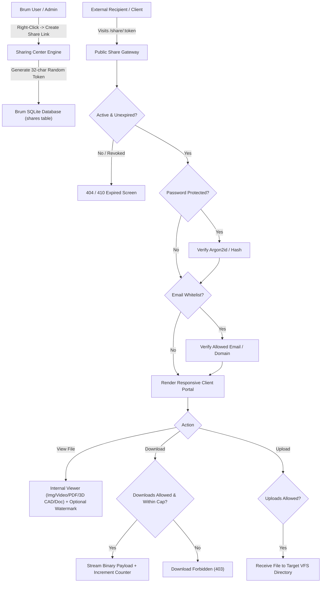

# Advanced Sharing Center & Client Portals Manual

> **Secure File Distribution, Granular Access Controls, Dynamic Watermarking & Public Client Portals**

The **Brum Sharing Center** is a native Core Function enabling users to generate authenticated, expiring, and granularly controlled public links for files and directories. It turns any Brum instance into a professional client portal, 3D design showcase, or secure file distribution hub with zero third-party cloud dependencies.

---

## Table of Contents
1. [Core Architecture & Security Flow](#1-core-architecture--security-flow)
2. [Dual-Mode Sharing Center Interface](#2-dual-mode-sharing-center-interface)
3. [Creating & Configuring Share Links](#3-creating--configuring-share-links)
4. [Granular Permissions & Access Controls](#4-granular-permissions--access-controls)
5. [Dynamic Watermarking & View-Only Galleries](#5-dynamic-watermarking--view-only-galleries)
6. [Public Client Portal & Integrated Viewers](#6-public-client-portal--integrated-viewers)
7. [Managing Shares, Revocation & Audit Logs](#7-managing-shares-revocation--audit-logs)
8. [REST API Reference](#8-rest-api-reference)

---

## 1. Core Architecture & Security Flow



* **Zero-Cloud Footprint**: Direct point-to-point delivery served natively by the Rust/Axum HTTP engine.
* **Cryptographic Token Entropy**: 32-character high-entropy alphanumeric access tokens resistant to URL enumeration.
* **Granular ACL Enforcement**: Permission flags (`allow_view`, `allow_download`, `allow_upload`) strictly verified per HTTP request.
* **Comprehensive Audit Trail**: Every view, download, password verification, and upload logs client IP, user-agent, action, and timestamp.

---

## 2. Dual-Mode Sharing Center Interface

Sharing Center operates in Brum's universal dual-mode architecture:
1. **Floating Window Mode**: A resizable, draggable floating dialog for inspecting shares, logs, and token links while continuing file management.
2. **In-Pane Docking Mode**: Dock directly into Panel 1 or Panel 2 to manage all active shares alongside your active directory structure.

---

## 3. Creating & Configuring Share Links

You can create a share link for any file, folder, or media collection:

### Method A: Via Right-Click Context Menu
1. In either file panel, right-click on the file or folder (or long-press on touch devices).
2. Select **Create Share Link...**.
3. Configure the sharing options in the modal:
   * **Share Name**: Descriptive label (e.g. `Client Design Proposal - Rev 2`).
   * **Expiration**: Auto-expire after 1 hour, 24 hours, 7 days, 30 days, or Never.
   * **Password Protection**: Optional passphrase for access gating.
   * **Download Limits**: Maximum allowable downloads before auto-revocation.
   * **Email Whitelist**: Restrict access to specific email addresses or domains (e.g. `client@example.com`, `@partner-studio.com`).
   * **Watermark**: Enable dynamic text watermark overlay for confidential reviews.
   * **Permissions**: Toggle View Only, Allow Download, and Allow Uploads.
4. Click **Generate Share Link**.
5. Copy the generated public URL (`https://your-domain.com/share/abc123xyz...`).

### Method B: Via Sharing Center
1. Open the **Sharing Center** from the Tools Launchpad or Settings (<kbd>F10</kbd>).
2. Click **+ New Share**.
3. Select the target path and configure permissions.

---

## 4. Granular Permissions & Access Controls

Brum's sharing engine decouples viewing from downloading, enabling flexible delivery scenarios:

| Permission Profile | View in Browser | Download Binary | Upload Files | Ideal Use Case |
| :--- | :---: | :---: | :---: | :--- |
| **Protected Showcase** | Yes | No | No | Design studios, confidential drafts, client proofs, photo galleries, 3D CAD models |
| **Standard Distribution** | Yes | Yes | No | Software releases, client deliverables, document distribution |
| **Client Upload Dropzone**| No | No | Yes | Homework submission, client document collection, raw footage drops |
| **Collaborative Hub** | Yes | Yes | Yes | Shared project workspaces, partner folders |

### Access Gatekeeper Controls
* **Password Verification**: Passwords are cryptographically verified before metadata or file previews are unlocked.
* **Email Verification**: When `Require Email` is enabled, the visitor must enter an email matching the allowed list/domain patterns before access is granted.
* **Download Counter Caps**: When `Max Downloads` (e.g., `5`) is reached, downloading is automatically disabled while viewing remains permitted.
* **Auto-Expiration**: Once the specified expiration time passes, all public endpoints immediately return `410 Gone`.

---

## 5. Dynamic Watermarking & View-Only Galleries

For creative professionals, architects, and agencies presenting pre-release drafts or design mockups:

1. **Watermark Engine**:
   * When `Watermark Enabled` is checked, Brum injects a dynamic, semi-transparent diagonal watermark across previewed assets.
   * Custom watermark text can include client names, confidentiality notices, or dynamic tags (e.g. `CONFIDENTIAL - REVIEW COPY ONLY - DO NOT DISTRIBUTE`).
2. **Download Prevention**:
   * Disabling `Allow Download` removes all download buttons and zip download actions from the public portal.
   * Internal viewers prevent standard direct-link extraction and right-click context scraping.

---

## 6. Public Client Portal & Integrated Viewers

Visitors accessing `/share/:token` are presented with a clean, branded, responsive public portal:

* **Single File Shares**: Direct preview with media player, image studio, 3D CAD viewer, or document reader.
* **Directory Shares**: Multi-file explorer with grid/list view toggles, breadcrumb navigation, and search filter.
* **Integrated Native Viewers**:
  * **3D CAD Models**: Interactive Three.js WebGL rendering for `.stl`, `.obj`, `.gltf`, `.glb`, `.3mf`, and `.step` with orbit rotation, wireframe toggles, and mesh stats.
  * **Images**: High-resolution viewer with pan, zoom, and EXIF metadata.
  * **Video & Audio**: Web media player supporting MP4, WebM, MP3, WAV, FLAC, OGG with seeking.
  * **Documents & PDF**: Visual PDF studio and markdown/text reader with syntax highlighting.
  * **Code**: Syntax highlighted code viewer with line numbers.
* **Upload Dropzone**:
  * When `Allow Upload` is enabled on folder shares, visitors see a drag-and-drop file upload target with multi-file progress indicators.
* **Responsive Layouts**: Fully responsive across Phone (`<600px`), Tablet (`600-1024px`), and Desktop (`>1024px`).

---

## 7. Managing Shares, Revocation & Audit Logs

Access the centralized **Sharing Center** anytime via Tools Launchpad or `openSharesManager()`:

### Live Management Features
* **Active vs Revoked Filter**: Inspect active, expired, and revoked shares.
* **One-Click Revoke / Restore**: Instantly pause access without deleting configuration or access logs.
* **Edit Permissions**: Modify expiration dates, toggle watermarks, or update passwords on existing live shares.
* **Audit Trail & Logs**:
  * Click **Logs** on any share to review all access events:
  * Records **Timestamp**, **IP Address**, **User Agent / Browser**, and **Action** (`view`, `download`, `upload`, `verify`).

---

## 8. REST API Reference

All share management endpoints are authenticated with standard JWT Bearer tokens:

### 1. Create Share Link
* **Endpoint**: `POST /api/shares`
* **Headers**: `Authorization: Bearer <token>`, `Content-Type: application/json`
* **Payload**:
```json
{
  "path": "/home/user/Projects/Design2026",
  "name": "Design Drafts 2026",
  "is_dir": true,
  "allow_view": true,
  "allow_download": false,
  "allow_upload": false,
  "password": "OptionalPassword123",
  "expires_in_hours": 72,
  "max_downloads": 0,
  "require_email": true,
  "allowed_emails": "client@example.com, @agency.com",
  "watermark_enabled": true,
  "watermark_text": "CLIENT DRAFT - CONFIDENTIAL"
}
```

### 2. List All Shares
* **Endpoint**: `GET /api/shares`
* **Headers**: `Authorization: Bearer <token>`
* **Response**: Array of `ShareItem` objects with access counts, expiration, and status.

### 3. Update Share Configuration
* **Endpoint**: `PUT /api/shares/:id`
* **Headers**: `Authorization: Bearer <token>`, `Content-Type: application/json`

### 4. Revoke / Restore Share
* **Endpoint**: `POST /api/shares/:id/revoke`
* **Payload**: `{"revoke": true}`

### 5. Fetch Access Logs
* **Endpoint**: `GET /api/shares/:id/logs`
* **Response**:
```json
[
  {
    "id": 1,
    "share_id": 4,
    "ip": "203.0.113.42",
    "user_agent": "Mozilla/5.0 (Windows NT 10.0; Win64; x64)...",
    "action": "view",
    "details": "previewed model.stl",
    "created_at": "2026-09-24T10:15:30Z"
  }
]
```

### 6. Delete Share
* **Endpoint**: `DELETE /api/shares/:id`

---

### Public Portal Endpoints (Unauthenticated / Token-Authenticated)
* `GET /share/:token` — Render responsive public share web portal.
* `GET /api/public/shares/:token` — Fetch public share metadata (name, is_dir, permissions, password_required).
* `POST /api/public/shares/:token/verify` — Verify password and obtain temporary access session.
* `POST /api/public/shares/:token/verify-email` — Verify guest email against allowed list.
* `GET /api/public/shares/:token/preview` — Stream asset preview (respects `watermark_enabled` and `allow_view`).
* `GET /api/public/shares/:token/download` — Stream binary download (respects `allow_download` and `max_downloads`).
* `POST /api/public/shares/:token/upload` — Upload multipart file to shared directory (respects `allow_upload`).
