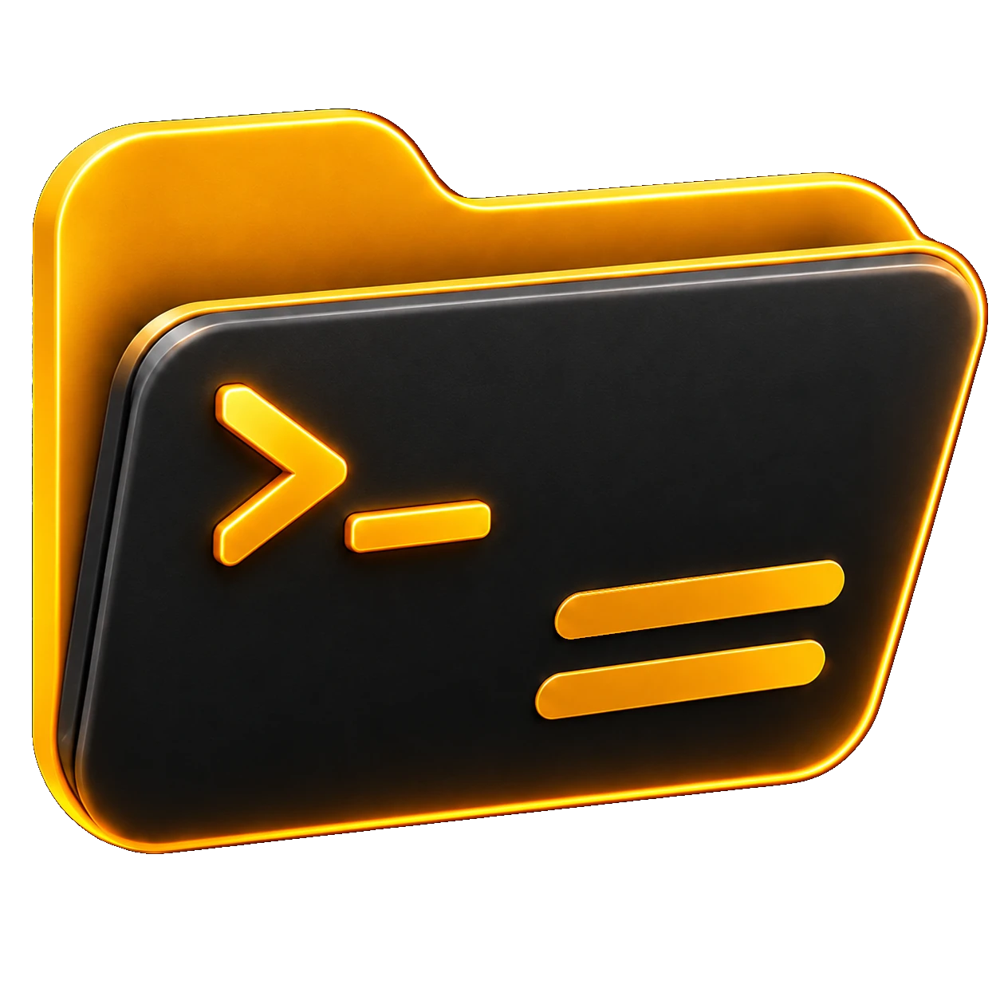

#  Keyboard Shortcuts & Navigation Guide

Brum provides orthodox keyboard-driven power navigation paired with intuitive mouse and touch gestures.

---

## Primary Function Keys (<kbd>F1</kbd> – <kbd>F10</kbd>)

| Key | Action | Description |
| :--- | :--- | :--- |
| **`Tab`** / **`Shift+Tab`** | **Switch Active Pane** | Cycle keyboard focus between open panels |
| **`F1`** | **Help & Shortcuts** | Open interactive keyboard shortcut reference modal |
| **`F2`** | **Rename Entry** | Quick inline or modal rename for the selected file or folder |
| **`F3`** | **Quick View / Media Viewer** | Open High-DPI Image Viewer, Video/Audio Player, or Document Viewer |
| **`F4`** | **Dual-Pane Editor** | Open built-in code and Markdown editor (EditorDog) |
| **`F5`** | **Copy / DeltaCopy** | Transfer selected items to the destination panel with delta skipping |
| **`F6`** | **Move File(s)** | Move selected items to the destination panel |
| **`Shift+F6`** / **`Ctrl+M`** | **Bulk Renamer** | Open advanced regex, numbering, case-conversion bulk renamer |
| **`F7`** | **New Folder** | Create a new directory in the active path |
| **`F8`** | **Delete / Trash** | Safely move selected items to Trash or permanent delete |
| **`F9`** / **`Ctrl+D`** | **Diff Engine** | Compare files or directories side-by-side |
| **`F10`** | **Settings Hub** | Open Settings modal (General, Desktop, Palette, Bookmarks, Keys) |

---

## Navigation, Panels & Selection

| Shortcut | Action |
| :--- | :--- |
| **`Alt+1`** .. **`Alt+4`** | Jump directly to Panel 1, 2, 3, or 4 |
| **`Ctrl+K`** / **`Ctrl+F`** | Spotlight Global Search & Action Palette |
| **`Ctrl+B`** | Toggle Flat / Branch View (recursive directory flattening) |
| **<kbd>Ctrl+`</kbd>** | Toggle Slide-Up Native Web Terminal (PTY) |
| **`Space`** / **`Insert`** | Toggle item selection and move cursor down |
| **`Ctrl+A`** | Select all items in active panel |
| **`Ctrl+Shift+A`** | Invert selection |
| **`Ctrl+C`** / **`Ctrl+X`** / **`Ctrl+V`** | Standard Clipboard Copy, Cut, and Paste across panels |
| **`Ctrl+P`** | Toggle Paranoid File Handling Mode (checksum verification) |
| **`Ctrl+Q`** / **`Cmd+Q`** | Clean Exit / Quit Brum |

---

## ARFAMP Winamp Shortcuts

| Key | Action |
| :--- | :--- |
| **`Z`** / **`B`** | Previous Track / Next Track |
| **`X`** / **`C`** / **`V`** | Play / Pause / Stop |
| **`L`** | Open Audio Files / Playlist File Picker |
| **`Alt+W`** | Windowshade Mode (collapses to mini-bar) |
| **`Alt+G`** | Toggle 10-Band Equalizer Window |
| **`Alt+E`** | Toggle Playlist Editor Window |
| **`S`** / **`R`** | Toggle Shuffle / Toggle Repeat |
| **`←`** / **`→`** | Seek Backward / Forward ±5 seconds |
| **`↑`** / **`↓`** | Volume ±5% |

---

## Mouse & Touch Navigation

* **Double-Click Empty Space**: Double-click anywhere on empty panel background space to immediately jump up one directory level (`..`).
* **Empty Space Right-Click**: Context menu to create files from templates, create directories, paste clipboard items, open terminal, or view disk usage.
* **Mobile Touch Engine**: Long-press (450ms) for context menus, swipe between panels, and adaptive touch hitboxes.
