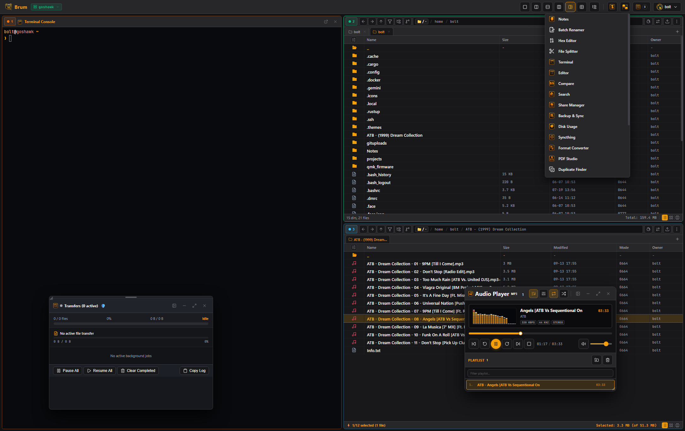

# Brum for Windows

<div align="center">
  
</div>

> **Multi-Panel File Commander for Web & Native Windows Desktop**  
> *Engineered in Rust & Microsoft WebView2 — High-Performance, Low Memory, Zero Electron Overhead.*

---

## 1. Overview & Architecture

Brum on Windows is distributed as:
1. **Standalone Native Desktop Application (`Brum.exe`)**:
   - Powered by Microsoft WebView2 (built into Windows 10 & 11).
   - Instant startup, ~30MB RAM idle consumption, full hardware-accelerated rendering.
   - Global System Tray icon with minimize-to-tray background operation.
2. **High-Performance Background & CLI Server (`brum.exe`)**:
   - Single-binary Axum async HTTP/WebSocket server.
   - Run as a headless background service, local server, or portable command-line tool.

---

## 2. Installation Options

### A. Windows Package Manager (`winget`)
Install with a single command from PowerShell or Windows Terminal:
```powershell
winget install Woofson.Brum
```

### B. Scoop Package Manager
Install via Scoop bucket:
```powershell
scoop bucket add woofson https://github.com/Woofson/scoop-bucket.git
scoop install brum
```

### C. Inno Setup Windows Installer (`.exe`)
1. Download `Brum-Setup-v1.7.0.exe` from [GitHub Releases](https://github.com/Woofson/brum/releases).
2. Choose between **Desktop GUI Application** or **Background Windows Service (SCM)** mode.
3. Automatically sets up Start Menu items, Desktop shortcuts, Context Menu integrations, and `%PROGRAMDATA%\Brum\` configuration roots.

### D. Zero-Install Standalone Portable ZIP
1. Download `brum-v1.7.0-windows-x86_64.zip` from [GitHub Releases](https://github.com/Woofson/brum/releases).
2. Extract anywhere (e.g. `C:\Tools\Brum` or a USB drive).
3. Double-click `Brum.exe` (Desktop GUI) or run `brum-cli.exe` — includes bundled `./themes/` folder and `config.toml`. Settings and database are saved portably in the local folder or `%APPDATA%\Brum\`.

---

## 3. Windows Service Architecture & SCM Management

Brum can run 24/7 as a background Windows Service managed by the native Windows Service Control Manager (SCM):

### Service Control Commands:
Run PowerShell or CMD as **Administrator**:
```powershell
# Install Brum as an auto-starting Windows Service
brum.exe --install-service

# Start the background service
brum.exe --start-service
# or: net start Brum

# Stop the service
brum.exe --stop-service
# or: net stop Brum

# Uninstall / remove the service registration
brum.exe --uninstall-service
```

### Windows Service Logging & Configuration:
* **Service Config**: `%PROGRAMDATA%\Brum\config.toml` (auto-created if missing with safe system defaults).
* **Database & Auth**: `%PROGRAMDATA%\Brum\brum.db`
* **Event Logging**: SCM lifecycle events and errors are recorded directly in the Windows Application Event Log (`eventvwr.msc`).

---

## 4. Windows Explorer Context Menu Integration

Add **"Open in Brum"** to the Windows Explorer right-click context menu for any directory, drive, or folder background:

### Register Context Menu:
Double-click `packaging\windows\register-context-menu.reg` or run:
```powershell
reg import packaging\windows\register-context-menu.reg
```

### Unregister Context Menu:
Double-click `packaging\windows\unregister-context-menu.reg` or run:
```powershell
reg import packaging\windows\unregister-context-menu.reg
```

---

## 5. Windows Filesystem Features

- **Native Windows SAM Authentication (`LogonUserW`)**: Authenticate directly with local Windows accounts or domain credentials against the Windows Security Account Manager (SAM) with automatic `%USERPROFILE%` home directory mapping and Admin group detection.
- **Drive Letter Navigation**: Switch seamlessly across `C:\`, `D:\`, `E:\`, `Z:\` in breadcrumbs and the quick jump menu.
- **Environment Variable Expansion**: Navigate directly to `%USERPROFILE%`, `%APPDATA%`, `%LOCALAPPDATA%`, `%TEMP%`, or `~/`.
- **Windows SMB & UNC Paths**: Open and browse network shares transparently using UNC format (`\\server\share\folder`) or orthodox `smb://user@server/share`.
- **Windows Recycle Bin Restoration**: Direct integration with Windows Recycle Bin (`C:\$Recycle.Bin`), parsing `$I*` deletion metadata and restoring files to their original paths.
- **Integrated Windows PowerShell / CMD Terminal**: Embedded slide-up terminal console defaulting to Windows PowerShell or `COMSPEC` (`cmd.exe`).
- **Transparent Encrypted Vaults (`.cdvault`)**: Password-protected AES-256-GCM / Argon2id zero-knowledge virtual storage containers.

---

## 6. Windows PE Metadata & Build Inspection

Windows executables (`brum.exe` and `Brum.exe`) automatically embed PE Version Resources:
* **File Version**: Formatted as `MAJOR.MINOR.PATCH.BUILD` (e.g. `1.6.1.419`).
* **Product Version**: Formatted as full SemVer 2.0.0 metadata (e.g. `1.6.1+build.419.git.8f42092`).
* **File Properties**: Right-click `brum.exe` in Windows Explorer -> **Properties** -> **Details** tab to view the exact build number, product version, and lab copyright information.

---

## 7. Multimedia & Transcoding Dependencies (Format Converter)

Brum runs completely standalone out-of-the-box with zero mandatory runtime dependencies for file browsing, terminals, and encrypted vaults.

To enable full audio/video and image transcoding capabilities in the built-in **Format Converter (ConvertX)** Core Function on Windows, install `ffmpeg` and `ImageMagick`:

### 1-Command Installation via Package Managers

#### Via Windows Package Manager (`winget`):
```powershell
winget install Gyan.FFmpeg ImageMagick.ImageMagick
```

#### Via Scoop:
```powershell
scoop install ffmpeg imagemagick
```

#### Via Chocolatey:
```powershell
choco install ffmpeg imagemagick
```

### Manual Installation & PATH Setup
If installing manually without a package manager:
1. Download official static builds from [gyan.dev/ffmpeg/builds](https://www.gyan.dev/ffmpeg/builds/) or [ffmpeg.org](https://ffmpeg.org/download.html).
2. Download ImageMagick from [imagemagick.org](https://imagemagick.org/script/download.php#windows).
3. Extract and add the directory containing `ffmpeg.exe` and `magick.exe` to your Windows System `PATH` environment variable.
4. Restart Brum or open a new terminal session.

---

## 8. Building from Source on Windows

### Prerequisites
- [Rust & Cargo](https://rustup.rs/) (`stable-x86_64-pc-windows-msvc` or cross-compile with `x86_64-pc-windows-gnu`)
- Visual Studio 2022 C++ Build Tools or MinGW-w64 toolchain
- Microsoft WebView2 Runtime (Preinstalled on Windows 10/11)

### Cross-Compiling from Linux:
```bash
cargo build --release --target x86_64-pc-windows-gnu
```

### Native PowerShell Build Script:
```powershell
Set-ExecutionPolicy -Scope Process -ExecutionPolicy Bypass
.\packaging\windows\build-windows.ps1 -Release
```

Build outputs are placed in `dist\windows\`:
- `dist\windows\brum-v1.7.0-windows-x86_64.zip` (Portable Distribution)
- `dist\windows\Brum-Setup-v1.7.0.exe` (Inno Setup Installer)
- `dist\windows\SHA256SUMS.txt` (Integrity Hashes)

---

## License
MIT License — Copyright (c) 2026 Bolt J Woofson <bolt@boop.no>
